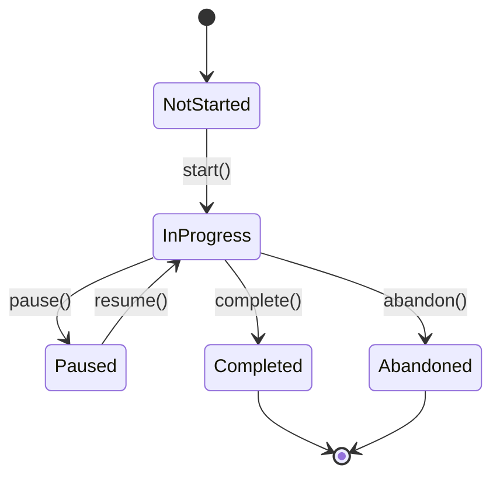

# Quiz Engine

The quiz engine is the heart of Quizlr, providing a flexible and extensible system for creating, managing, and scoring quizzes.

## Architecture

The quiz engine consists of four main components:

```
┌─────────────┐     ┌──────────┐     ┌─────────┐
│  Questions  │────▶│   Quiz   │────▶│ Session │
└─────────────┘     └──────────┘     └─────────┘
                                           │
                                           ▼
                                     ┌─────────┐
                                     │ Scoring │
                                     └─────────┘
```

## Core Components

### Questions

Questions are the fundamental unit of content in Quizlr. Each question has:

- **ID**: Unique identifier (UUID)
- **Type**: One of seven supported question types
- **Topic**: Associated topic for categorization
- **Difficulty**: Float value from 0.0 (easy) to 1.0 (hard)
- **Metadata**: Flexible key-value storage
- **Citations**: Sources and references

See [Question Types](./question-types.md) for detailed information about each type.

### Quiz

A Quiz is a collection of questions with configuration options:

```rust
pub struct Quiz {
    pub title: String,
    pub description: Option<String>,
    pub questions: Vec<Question>,
    pub pass_threshold: f32,
    pub allow_skip: bool,
    pub show_explanations: bool,
    pub randomize_questions: bool,
    // ... more fields
}
```

#### Quiz Builder

Quizzes are created using the builder pattern for ergonomic construction:

```rust
let quiz = QuizBuilder::new("Rust Basics")
    .description("Test your knowledge of Rust fundamentals")
    .pass_threshold(0.8)
    .randomize_questions(true)
    .add_question(question1)
    .add_question(question2)
    .build();
```

### Session

A Session tracks a user's progress through a quiz:

- **State Management**: NotStarted → InProgress → Completed/Abandoned
- **Response Tracking**: Records all answers with timestamps
- **Pause/Resume**: Supports interrupting and continuing
- **Progress Calculation**: Real-time progress tracking

#### Session States



### Scoring

Quizlr supports multiple scoring strategies to accommodate different learning scenarios:

1. **Simple**: Basic correct/incorrect scoring
2. **Time-Weighted**: Factors in response time
3. **Difficulty-Weighted**: Rewards harder questions
4. **Adaptive**: Comprehensive scoring with multiple factors

See [Scoring Strategies](./scoring-strategies.md) for detailed algorithms.

## Usage Example

Here's a complete example of using the quiz engine:

```rust
use quizlr_core::quiz::*;

// Create questions
let q1 = Question::new(
    QuestionType::TrueFalse {
        statement: "Rust has a garbage collector".to_string(),
        correct_answer: false,
        explanation: Some("Rust uses ownership instead".to_string()),
    },
    topic_id,
    0.3, // difficulty
);

// Build quiz
let quiz = QuizBuilder::new("Rust Memory Management")
    .add_question(q1)
    .pass_threshold(0.7)
    .build();

// Start session
let mut session = QuizSession::new(quiz.id, user_id);
session.start().unwrap();

// Submit answer
let is_correct = session.submit_answer(
    &quiz.questions[0],
    Answer::TrueFalse(false),
    30, // time in seconds
).unwrap();

// Complete and score
let summary = session.complete().unwrap();
let score = ScoringStrategy::Simple.calculate_score(&session, &quiz.questions);

println!("Score: {:.1}%", score.raw_score * 100.0);
```

## Error Handling

The quiz engine uses a comprehensive error type:

```rust
pub enum QuizlrError {
    Storage(String),
    Auth(String),
    QuizEngine(String),
    InvalidInput(String),
    NotFound(String),
    // ... more variants
}
```

All fallible operations return `Result<T, QuizlrError>` for consistent error handling.

## Thread Safety

All quiz engine types implement `Send` and `Sync`, making them safe for use in concurrent contexts. The engine itself is stateless, with all state managed in Session objects.

## Extensibility

The quiz engine is designed for extensibility:

- **Custom Question Types**: Implement the Question trait
- **Custom Scoring**: Implement the ScoringStrategy trait
- **Storage Backends**: Implement the Storage trait
- **Serialization**: All types implement Serde traits

## Performance Considerations

- Questions are cloned when added to sessions (immutable during quiz)
- Scoring calculations are O(n) where n is number of questions
- Session state updates are O(1)
- Quiz randomization uses thread-local RNG for efficiency